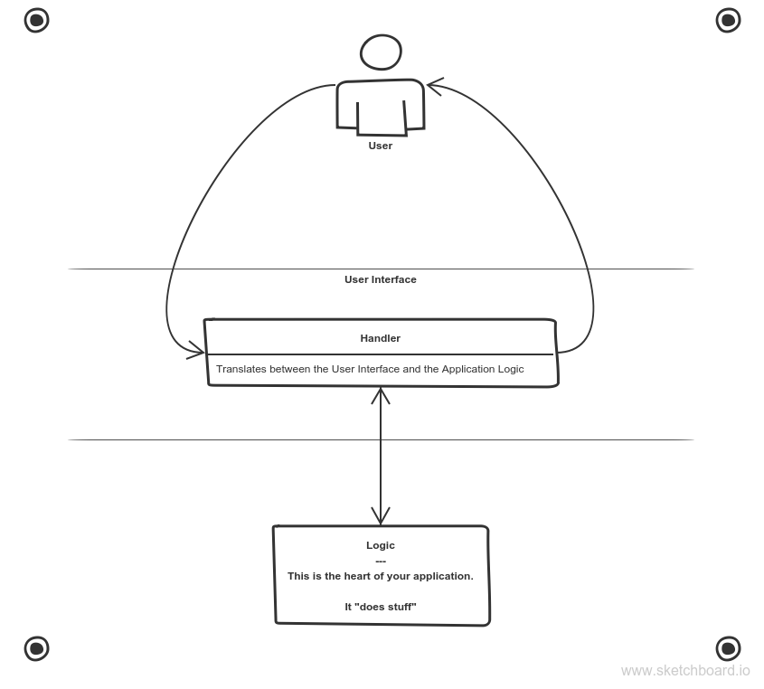

# Clean Calc

This project is designed to illustrate one of, if not __the most__, fundamental principle of software design:

> SEPARATION OF CONCERNS

"Separation of concerns" means that each file, each piece of code, has one simple and well defined purpose.  In this project you will be exploring the separation of UI framework, input handling, and application logic.  You will build a basic calculator object then use that same object to take arguments from the terminal and the browser.  The concerns are:
* UI - command line, HTML
* Middleware - process.argv, event listeners
* Logic - the cleancalc object

It is very important that you build your calc object with exactly the property names, arguments, and return values specified.  Doing this is called "developing to an interface".  If you do this correctly you will be able to replace anyone's cleancalc object with yours and your application will continue working.  The magic of software design!

Understanding this principle will help with testing, development scheduling, collaboration, maintenance, ... _everything_. In our experience, understanding separation of concerns is the most important thing a new programmer can learn.  Far more important than learning new libraries, powerful devtools, or even being good at solving programming challenges.  

So if this project feels too easy and you find yourself wanting to make it more complicated, remember that the code isn't the point of this project.  The design is the point.  Pay attention to how we use specs to define and develop the calculator, and how we integrate that object into the HTML.

To see how well you did, go to the "cleancalc" channel on Slack to share objects.  Try swapping out your object for someone else's, if your application still works you both did it right.  There is no other way to know.

### Index
* [Learning Objectives](#learning-objectives)
* [Specifications](#specifications)
* [Resources](#resources)

---

## Learning Objectives

* Separation of concerns
* 3 layer app architecture
* Developing from specs
* Logic vs. Framework
* Basic collaboration (trading calc objects)
* Basic OOP

### 3 Layered Architecture




[TOP](#index)

---

## Specifications

This project has several steps to it

1. Build an object to match [these specs](https://github.com/elewa-academy/Fundamentals/blob/master/08-clean-calc/clean-calc-series/1-cleancalc.js). 
2. Write a JS file to take command line arguments and pass them into your calculator. 
    * Your three layers are:
        1. UI - the terminal
        2. Middleware - process.argsv & console.log
        3. Logic - Cleancalc Object
    * You will write a single JS file that takes in command line args, passes them through the calc Object, and prints the result to the console.
3. Reuse your calc object in a basic browser app.  The event handlers will take the user's input, pass it through the calc object, and write the results to the DOM.  
    * Your three layers:
    a. UI - the browser
    b. Middleware - event listeners & DOM methods
    c. Logic - Cleancalc Object
    * Each event listener will only call the calc object once, and will only ever call the operate() method:
        ```js
            ...
            // get user input from the DOM
            let result = cleancalc.operate(user_operation, arg1, arg2);
            // write 'result' into the DOM
            ...
        ```
    * Your project should have this structure:
        * index.html
        * /public
          * middleware.js
          * cleancalc.js
4. Make a repo for this project and put it on your portfolio. 
    * Gh-pages demo
    * README 
        * Description of app's behavior
        * How to use the app
        * Project structure
        * Specs for your calc
        * Link to a [Gist](https://gist.github.com) with your finished calc object
    * Tests for the calc object
    * Source code for every step you completed in a separate folder
5. Go to Slack and trade Gists. See what happens if you replace your cleancalc.js with someone else's.  Does it make your app crash? (This is called _dependency injection_.)

More Practice:
* Revisit your completed CodeWar repositories.  Add UI and a handler to them so users can run your solution with their own arguments directly from Gh-Pages.


[TOP](#index)

---

## Resources

__Cleancalc video series__:
* [Part 1](https://www.youtube.com/watch?v=RXTTYVPPHNo)
* [Part 2](https://www.youtube.com/watch?v=WjbQZZpKdd4)
* [Part 3](https://www.youtube.com/watch?v=cjFEm_Drpnw)
* [Part 4](https://www.youtube.com/watch?v=7VjtfihfwuE)
* [Part 5](https://www.youtube.com/watch?v=XgUvVRj2Nao)
* [Code to study](https://github.com/elewa-academy/Fundamentals/tree/master/)
* [3 Layer Cleancalc](https://gist.github.com/colevandersWands/3e34dd6587c3639b17de9d46041f0096)
 

__Separation of Concerns__:
* [Outstanding video](https://www.youtube.com/watch?v=WDNvqxZBI_U)
* [DevIQ article](http://deviq.com/separation-of-concerns/)
* [Stackexchange Question](https://softwareengineering.stackexchange.com/questions/32581/how-do-you-explain-separation-of-concerns-to-others)


__Programming Concepts__:
* [Abstractions](https://github.com/elewa-academy/General-Resources/blob/master/programming-resources/abstractions.md)
* [Procedural Programming](https://github.com/elewa-academy/General-Resources/blob/master/programming-resources/programming-and-paradigms/01-procedural-programming.md)
* [Basic OOP in Js](https://github.com/elewa-academy/General-Resources/blob/master/programming-resources/programming-and-paradigms/02-oop-single-objects.md)
* [From procedural to OOP](https://www.youtube.com/watch?v=rlLuL3jYLvA).  An outstanding video.
* [Event-Driven Programming](https://github.com/elewa-academy/General-Resources/blob/master/programming-resources/programming-and-paradigms/04-event-driven-programming.md)

__JavaScript Objects__:
* [Video Walk-Through](https://www.youtube.com/watch?v=f-aKxXt8Y0A)
* [Code from video](https://github.com/elewa-academy/Fundamentals/tree/master/09-clean-calc/object-video-code)
* [Progressive code samples](https://github.com/elewa-academy/General-Resources/tree/master/javascript/using-js/objects)
* [Context Examples](https://gist.github.com/colevandersWands/cc8097b59102042a878bdc9b6df89012)

__Process.argv__:
* [Stackabuse Article](http://stackabuse.com/command-line-arguments-in-node-js/)
* [CC Videos](https://www.youtube.com/watch?v=PG0_eGxrCAk)

__DOM__:
* [FreeCodeCamp](https://www.freecodecamp.org/).  Complete the jQuery exercises if you haven't yet.
* [w3 Event Listeners](https://www.w3schools.com/js/js_htmldom_eventlistener.asp)
* [Building an Addition UI](https://www.youtube.com/watch?v=e57ReoUn6kM)


[TOP](#index)

---

Closing Thoughts:  
    


___
___
### <a href="http://elewa.education/blog" target="_blank"></a>

